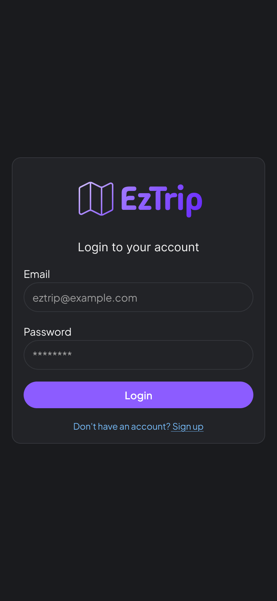
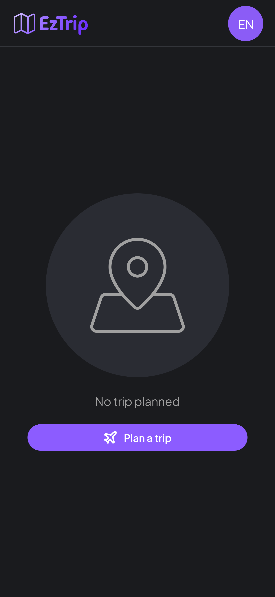
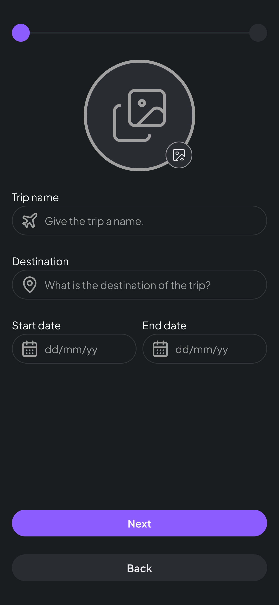
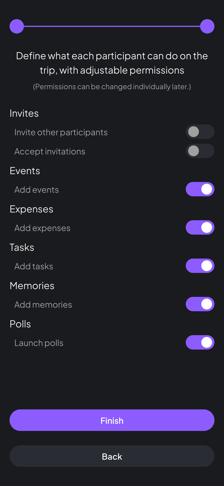
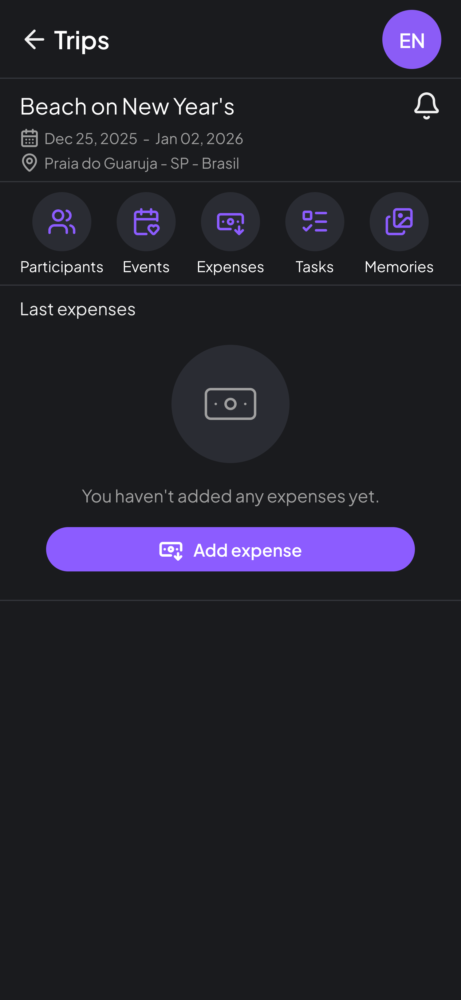
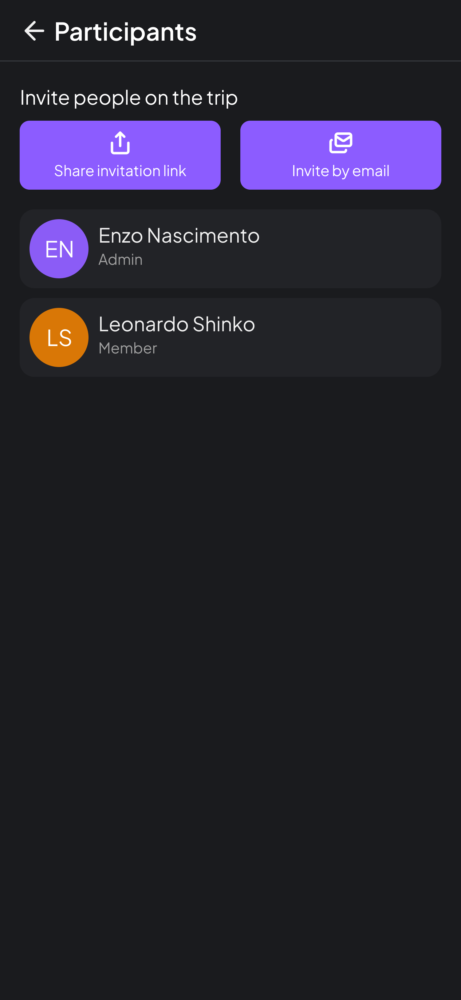
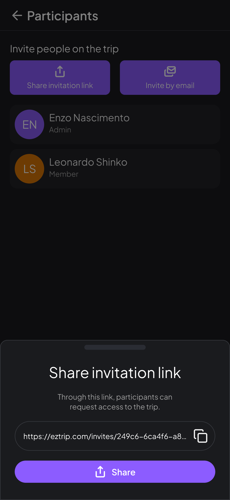
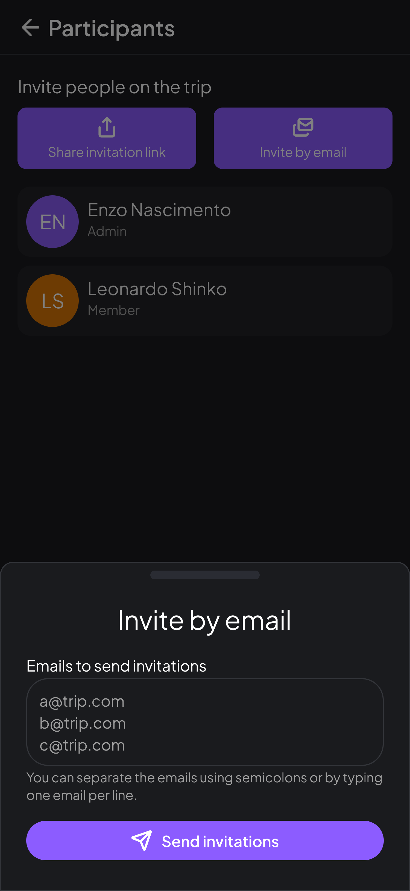
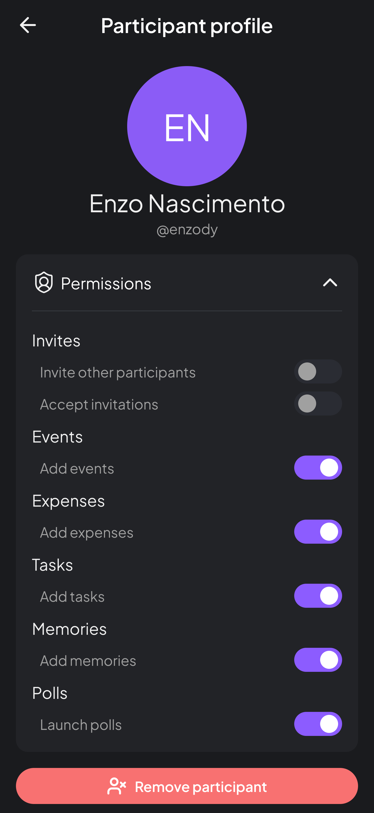

## 🧩 **1. Requisitos do Sistema de Software**

### 1.1.2 Requisitos Funcionais

| Código      | Requisito Funcional            | Prioridade | Descrição                                                                                                                                                              |
| ----------- | ------------------------------ | ---------- | ---------------------------------------------------------------------------------------------------------------------------------------------------------------------- |
| **[RF001]** | Criar Viagem                   | Essencial  | O sistema deve permitir que um usuário autenticado crie uma nova viagem informando nome, destino, datas e participantes. O criador torna-se o Administrador da viagem. |
| **[RF002]** | Convidar Participantes         | Essencial  | O Administrador ou participante com permissão deve poder gerar convites por e-mail ou link para que outros usuários ingressem na viagem.                               |
| **[RF003]** | Gerenciar Permissões           | Importante | O Administrador deve poder definir e ajustar permissões por módulo (Gastos, Roteiro, Tarefas, Enquetes, Lembranças).                                                   |
| **[RF004]** | Registrar Gastos               | Essencial  | O sistema deve permitir o registro de gastos, definindo valor, pagador, participantes envolvidos e categoria. O sistema deve calcular automaticamente a divisão.       |
| **[RF005]** | Criar e Gerenciar Roteiro      | Importante | O sistema deve permitir criar e editar eventos da viagem, com data, hora e local, e exibir visualizações por dia e por período total.                                  |
| **[RF006]** | Criar e Atribuir Tarefas       | Importante | O sistema deve permitir criar tarefas com título, descrição, prazo e responsáveis. Deve permitir marcar como concluída.                                                |
| **[RF007]** | Criar Enquetes                 | Desejável  | O sistema deve permitir criar enquetes com opções de voto e prazo de encerramento, registrando resultados.                                                             |
| **[RF008]** | Upload de Lembranças (Galeria) | Desejável  | O sistema deve permitir o upload de fotos e vídeos associados à viagem, eventos ou pessoas, criando uma galeria compartilhada.                                         |
| **[RF009]** | Finalizar Viagem               | Importante | O Administrador pode finalizar uma viagem, bloqueando novas edições e preservando histórico.                                                                           |
| **[RF010]** | Autenticar Usuário (Login)     | Essencial  | O sistema deve autenticar usuários cadastrados com e-mail e senha, gerenciando sessão via token JWT e refresh token.                                                   |

---

### 1.1.3 Requisitos Não-Funcionais

| Código                           | Requisito  | Prioridade                                                                                                                                                                                                                                     | Descrição |
| -------------------------------- | ---------- | ---------------------------------------------------------------------------------------------------------------------------------------------------------------------------------------------------------------------------------------------- | --------- |
| **[RNF001] – Usabilidade**       | Essencial  | O sistema deve possuir uma interface intuitiva e consistente, com foco em simplicidade na criação e gestão das viagens, permitindo que usuários com pouca experiência consigam realizar ações básicas sem treinamento.                         |           |
| **[RNF002] – Interface Gráfica** | Importante | O sistema deve utilizar design responsivo, adaptável a desktop e mobile, com ícones e feedbacks visuais coerentes. Textos e rótulos devem estar em português e seguir o padrão de design definido (cores, tipografia e componentes uniformes). |           |
| **[RNF003] – Ajuda**             | Importante | O sistema deve disponibilizar tutoriais e dicas contextuais em cada módulo (ex: tooltip, guia inicial) e uma página de FAQ para auxiliar novos usuários.                                                                                       |           |
| **[RNF004] – Segurança**         | Essencial  | O sistema deve utilizar autenticação via JWT e refresh token, armazenando tokens em cookies com flags `HttpOnly` e `Secure` (em produção). Todas as requisições devem trafegar sob HTTPS.                                                      |           |
| **[RNF005] – Desempenho**        | Importante | O sistema deve apresentar resposta às interações do usuário em até 2 segundos em condições normais de rede.                                                                                                                                    |           |
| **[RNF006] – Disponibilidade**   | Desejável  | O sistema deve estar disponível 24/7, com tolerância a falhas em módulos independentes (ex: autenticação, uploads, etc.).                                                                                                                      |           |
| **[RNF007] – Tecnologia**        | Essencial  | O backend deve ser desenvolvido em .NET 8, com arquitetura modular, e o frontend em React + TypeScript. Comunicação em tempo real deve ser implementada via SignalR.                                                                           |           |
| **[RNF008] – Banco de Dados**    | Essencial  | O sistema deve utilizar PostgreSQL como banco de dados relacional principal.                                                                                                                                                                   |           |

---

### 1.1.4 Regras de Negócio

| Código      | Regra de Negócio              | Descrição                                                                                                                                                                         |
| ----------- | ----------------------------- | --------------------------------------------------------------------------------------------------------------------------------------------------------------------------------- |
| **[RN001]** | Contexto de Viagem            | Todas as ações (gastos, tarefas, enquetes, etc.) devem estar associadas a uma viagem existente.                                                                                   |
| **[RN002]** | Propriedade da Viagem         | O criador da viagem é o Administrador e possui autoridade máxima, podendo delegar permissões.                                                                                     |
| **[RN003]** | Permissões por Módulo         | Cada módulo (Gastos, Roteiro, Tarefas, Enquetes, Lembranças, Convites) deve respeitar permissões definidas por leitura, criação, edição e exclusão.                               |
| **[RN004]** | Convites e Acesso             | Apenas o Administrador ou participantes com permissão “Convidar participantes” podem gerar convites. Convites por link devem ter validade e aprovação antes da entrada na viagem. |
| **[RN005]** | Auditoria                     | Ações sensíveis (ex: finalização de viagem, exclusão de dados, aprovação de convites) devem ser registradas em logs imutáveis.                                                    |
| **[RN006]** | Finalização de Viagem         | Uma viagem finalizada não pode mais ser editada, mas seus dados permanecem disponíveis em modo de leitura.                                                                        |
| **[RN007]** | Persistência de Histórico     | Nenhuma exclusão deve apagar registros de ações ou participações (ex: gastos, tarefas e votos).                                                                                   |
| **[RN008]** | Política de Mínimo Privilégio | Permissões devem ser atribuídas de forma a garantir que cada participante tenha apenas o acesso necessário para suas funções.                                                     |

---

## 🧩 **1.2 Modelagem dos Requisitos Funcionais**

---

### **1.2.1 Atores**

| **Ator**                        | **Descrição**                                                                                                                                                                              |
| ------------------------------- | ------------------------------------------------------------------------------------------------------------------------------------------------------------------------------------------ |
| **Usuário**                     | Pessoa autenticada que utiliza o EzTrip para planejar e participar de viagens. Pode criar viagens, visualizar roteiros, registrar gastos e interagir com o grupo conforme suas permissões. |
| **Administrador (Owner)**       | Usuário que cria a viagem. Possui autoridade total sobre o grupo: gerencia permissões, convites, finalização da viagem e exclusões.                                                        |
| **Participante**                | Usuário convidado para uma viagem. Suas ações são controladas por permissões atribuídas pelo Administrador (ex: criar tarefas, lançar gastos, votar em enquetes).                          |
| **Convidado (não autenticado)** | Pessoa que recebeu um link de convite, mas ainda não está vinculada à viagem. Pode solicitar acesso mediante aprovação.                                                                    |

---

### **1.2.2 Diagrama de Caso de Uso**

No diagrama geral do EzTrip, os principais **atores** e **casos de uso** se relacionam da seguinte forma:

- **Usuário**

  - [UC01] Fazer Login
  - [UC02] Criar Viagem

- **Administrador (Owner)**

  - [UC03] Convidar Participantes
  - [UC04] Definir Permissões

- **Participante**

  - [UC05] Registrar Gasto

---

### **1.2.3 Especificação dos Casos de Uso**

Abaixo estão os **5 casos de uso principais** do sistema **EzTrip**, sendo o **Login obrigatório** conforme o enunciado.

---

#### **[UC01] – Fazer Login**

- **Sumário:** Permite ao usuário acessar o sistema informando e-mail e senha válidos.
- **Ator Primário:** Usuário
- **Casos de Uso Associados:** —
- **Pré-condições:** O usuário deve possuir cadastro ativo.
- **Fluxo Principal:**

  1. O usuário acessa a tela de login.
  2. Informa e-mail e senha.
  3. O sistema valida as credenciais.
  4. O sistema gera o token JWT e refresh token, armazenando o refresh token em cookie seguro.
  5. O usuário é redirecionado para a página de “Minhas Viagens”.

- **Fluxos Alternativos:**

  - a. Credenciais inválidas → O sistema exibe mensagem de erro.
  - b. Usuário inativo → O sistema bloqueia o acesso e sugere contato com o suporte.

- **Pós-condições:** O usuário está autenticado e com sessão ativa.
- **Requisitos Associados:** RF010, RNF004
- **Regras de Negócio:** RN001, RN002
- **Interface:** Tela de Login (I001)

---

#### **[UC02] – Criar Viagem**

- **Sumário:** Permite ao usuário criar uma nova viagem, tornando-se o Administrador.
- **Ator Primário:** Usuário
- **Casos de Uso Associados:** [UC01] – Fazer Login
- **Pré-condições:** O usuário deve estar autenticado.
- **Fluxo Principal:**

  1. O usuário seleciona “Planejar uma viagem”.
  2. Informa nome, destino, datas de início e fim.
  3. O sistema cria o registro da viagem e define o usuário como Administrador.
  4. O sistema aplica as permissões padrão e exibe a página da viagem.

- **Fluxos Alternativos:**

  - a. Falha de validação (dados obrigatórios ausentes) → o sistema exibe mensagem de erro.

- **Pós-condições:** Viagem criada e disponível na lista do usuário.
- **Requisitos Associados:** RF001
- **Regras de Negócio:** RN001, RN002
- **Interface:** [Tela de Viagens (Vazia) (I002)] -> [Tela de Criar Viagem - Step 1 (I003)] -> [Tela de Criar Viagem - Step 2 (I004)]

---

#### **[UC03] – Convidar Participantes**

- **Sumário:** Permite que o Administrador convide novos usuários por e-mail ou link.
- **Ator Primário:** Administrador
- **Casos de Uso Associados:** [UC02] – Criar Viagem
- **Pré-condições:** O usuário deve ser o Administrador da viagem ou possuir permissão “Convidar participantes”.
- **Fluxo Principal:**

  1. O Administrador acessa o módulo “Participantes”.
  2. Escolhe o método de convite: e-mail direto ou link temporário.
  3. O sistema gera e registra o convite.
  4. O participante convidado recebe o e-mail ou acessa o link e solicita entrada.
  5. O Administrador aprova a solicitação de acesso.

- **Fluxos Alternativos:**

  - a. Link expirado → o sistema exibe mensagem e nega acesso.

- **Pós-condições:** Participante adicionado à viagem com permissões padrão.
- **Requisitos Associados:** RF002
- **Regras de Negócio:** RN004, RN008
- **Interface:** [Tela de Participantes (I006)] -> [Tela de Participantes + (Convite por link) (I007)] -> [Tela de Participantes + (Convite por e-mail) (I008)]

---

#### **[UC04] – Definir Permissões**

- **Sumário:** Permite ao Administrador gerenciar as permissões de acesso de cada participante nos módulos da viagem.
- **Ator Primário:** Administrador
- **Casos de Uso Associados:** [UC02] – Criar Viagem
- **Pré-condições:** O usuário deve ser o Administrador da viagem.
- **Fluxo Principal:**

  1. O Administrador acessa o módulo “Partipantes”.
  2. O sistema exibe a lista de participantes.
  3. O Administrador seleciona um participante e ajusta permissões por módulo (ex: Gastos, Roteiro, Enquetes).
  4. O sistema salva as novas configurações e registra o log da alteração.

- **Fluxos Alternativos:**

  - a. Tentativa de alteração sem privilégio de administrador → o sistema bloqueia a ação e exibe aviso.

- **Pós-condições:** Permissões atualizadas e aplicadas aos módulos da viagem.
- **Requisitos Associados:** RF003
- **Regras de Negócio:** RN002, RN003, RN008
- **Interface:** [Tela de Participantes (I006)] -> [Tela de Perfil de Participante (I009)]

---

#### **[UC05] – Registrar Gasto**

- **Sumário:** Permite registrar um gasto e dividir o valor entre os participantes.
- **Ator Primário:** Participante
- **Casos de Uso Associados:** [UC02] – Criar Viagem
- **Pré-condições:** O usuário deve estar autenticado e ter permissão de registrar gastos.
- **Fluxo Principal:**

  1. O participante seleciona “Adicionar Gasto”.
  2. Informa descrição, valor, moeda e pessoas envolvidas.
  3. O sistema divide automaticamente o valor e atualiza o balanço de cada participante.
  4. O sistema registra a ação no log da viagem.

- **Fluxos Alternativos:**

  - a. Falha de conexão → o sistema salva o gasto localmente e sincroniza depois.

- **Pós-condições:** Gasto adicionado à viagem e saldo atualizado.
- **Requisitos Associados:** RF004
- **Regras de Negócio:** RN001, RN005, RN007
- **Interface:** Tela de Gastos (I005)

---

