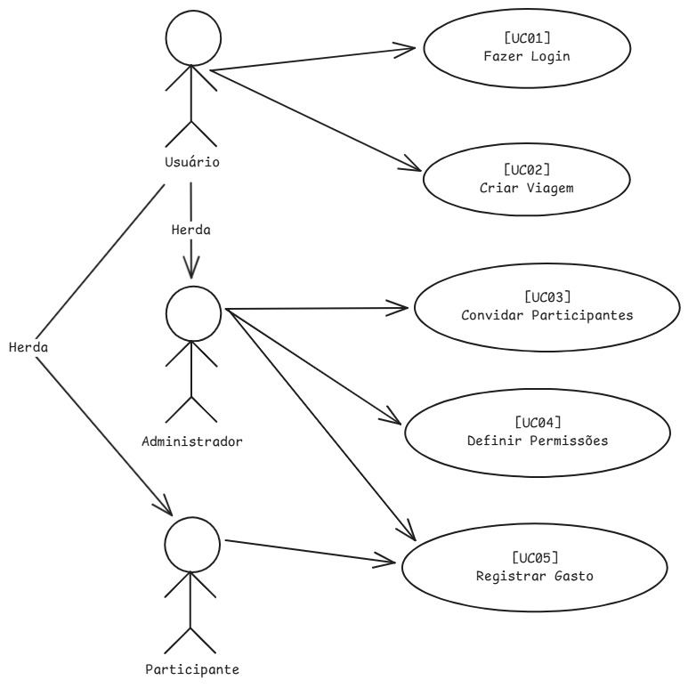
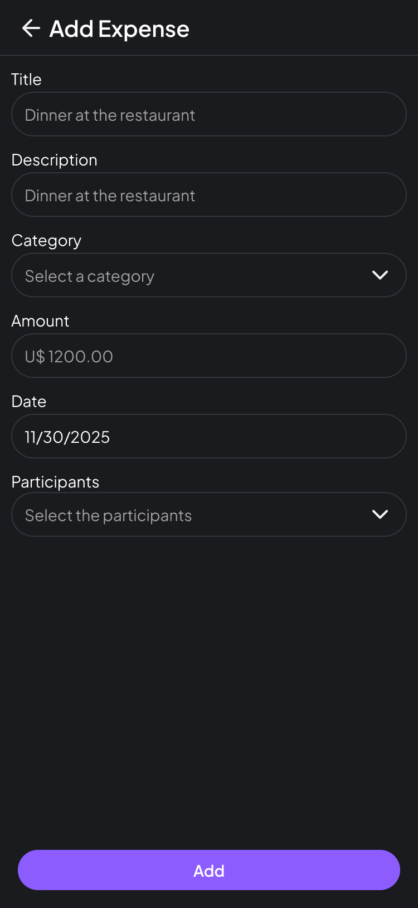
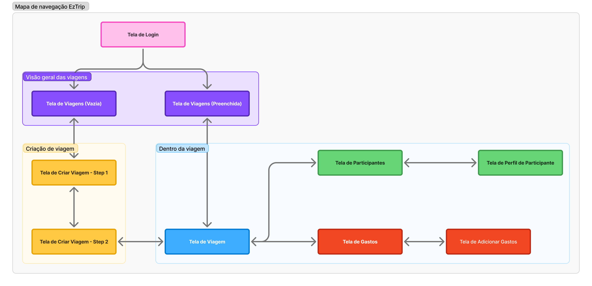
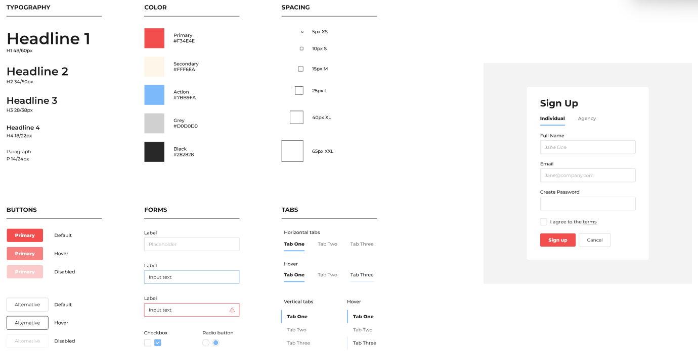

## **Integrantes**
ENZO NASCIMENTO ESTRELA ALVES 
GABRIEL VITOR DOS SANTOS  
THIAGO SOARES SOUSA  
YURI FURTADO RODRIGUES 
LEONARDO SHINKO YONAMINE 

## 🧩 **1. Requisitos do Sistema de Software**

### 1.1.2 Requisitos Funcionais

| Código      | Requisito Funcional            | Prioridade | Descrição                                                                                                                                                              |
| ----------- | ------------------------------ | ---------- | ---------------------------------------------------------------------------------------------------------------------------------------------------------------------- |
| **[RF001]** | Criar Viagem                   | Essencial  | O sistema deve permitir que um usuário autenticado crie uma nova viagem informando nome, destino, datas e participantes. O criador torna-se o Administrador da viagem. |
| **[RF002]** | Convidar Participantes         | Essencial  | O Administrador ou participante com permissão deve poder gerar convites por e-mail ou link para que outros usuários ingressem na viagem.                               |
| **[RF003]** | Gerenciar Permissões           | Importante | O Administrador deve poder definir e ajustar permissões por módulo (Gastos, Roteiro, Tarefas, Enquetes, Lembranças).                                                   |
| **[RF004]** | Adicionar Gastos               | Essencial  | O sistema deve permitir o registro de gastos, definindo valor, pagador, participantes envolvidos e categoria. O sistema deve calcular automaticamente a divisão.       |
| **[RF005]** | Criar e Gerenciar Roteiro      | Importante | O sistema deve permitir criar e editar eventos da viagem, com data, hora e local, e exibir visualizações por dia e por período total.                                  |
| **[RF006]** | Criar e Atribuir Tarefas       | Importante | O sistema deve permitir criar tarefas com título, descrição, prazo e responsáveis. Deve permitir marcar como concluída.                                                |
| **[RF007]** | Criar Enquetes                 | Desejável  | O sistema deve permitir criar enquetes com opções de voto e prazo de encerramento, registrando resultados.                                                             |
| **[RF008]** | Upload de Lembranças (Galeria) | Desejável  | O sistema deve permitir o upload de fotos e vídeos associados à viagem, eventos ou pessoas, criando uma galeria compartilhada.                                         |
| **[RF009]** | Finalizar Viagem               | Importante | O Administrador pode finalizar uma viagem, bloqueando novas edições e preservando histórico.                                                                           |
| **[RF010]** | Autenticar Usuário (Login)     | Essencial  | O sistema deve autenticar usuários cadastrados com e-mail e senha, gerenciando sessão via token JWT e refresh token.                                                   |

---

### 1.1.3 Requisitos Não-Funcionais

| Código                           | Requisito  | Prioridade                                                                                                                                                                                                                                     | Descrição |
| -------------------------------- | ---------- | ---------------------------------------------------------------------------------------------------------------------------------------------------------------------------------------------------------------------------------------------- | --------- |
| **[RNF001] – Usabilidade**       | Essencial  | O sistema deve possuir uma interface intuitiva e consistente, com foco em simplicidade na criação e gestão das viagens, permitindo que usuários com pouca experiência consigam realizar ações básicas sem treinamento.                         |           |
| **[RNF002] – Interface Gráfica** | Importante | O sistema deve utilizar design responsivo, adaptável a desktop e mobile, com ícones e feedbacks visuais coerentes. Textos e rótulos devem estar em português e seguir o padrão de design definido (cores, tipografia e componentes uniformes). |           |
| **[RNF003] – Ajuda**             | Importante | O sistema deve disponibilizar tutoriais e dicas contextuais em cada módulo (ex: tooltip, guia inicial) e uma página de FAQ para auxiliar novos usuários.                                                                                       |           |
| **[RNF004] – Segurança**         | Essencial  | O sistema deve utilizar autenticação via JWT e refresh token, armazenando tokens em cookies com flags `HttpOnly` e `Secure` (em produção). Todas as requisições devem trafegar sob HTTPS.                                                      |           |
| **[RNF005] – Desempenho**        | Importante | O sistema deve apresentar resposta às interações do usuário em até 2 segundos em condições normais de rede.                                                                                                                                    |           |
| **[RNF006] – Disponibilidade**   | Desejável  | O sistema deve estar disponível 24/7, com tolerância a falhas em módulos independentes (ex: autenticação, uploads, etc.).                                                                                                                      |           |
| **[RNF007] – Tecnologia**        | Essencial  | O backend deve ser desenvolvido em .NET 8, com arquitetura modular, e o frontend em React + TypeScript. Comunicação em tempo real deve ser implementada via SignalR.                                                                           |           |
| **[RNF008] – Banco de Dados**    | Essencial  | O sistema deve utilizar PostgreSQL como banco de dados relacional principal.                                                                                                                                                                   |           |

---

### 1.1.4 Regras de Negócio

| Código      | Regra de Negócio              | Descrição                                                                                                                                                                         |
| ----------- | ----------------------------- | --------------------------------------------------------------------------------------------------------------------------------------------------------------------------------- |
| **[RN001]** | Contexto de Viagem            | Todas as ações (gastos, tarefas, enquetes, etc.) devem estar associadas a uma viagem existente.                                                                                   |
| **[RN002]** | Propriedade da Viagem         | O criador da viagem é o Administrador e possui autoridade máxima, podendo delegar permissões.                                                                                     |
| **[RN003]** | Permissões por Módulo         | Cada módulo (Gastos, Roteiro, Tarefas, Enquetes, Lembranças, Convites) deve respeitar permissões definidas por leitura, criação, edição e exclusão.                               |
| **[RN004]** | Convites e Acesso             | Apenas o Administrador ou participantes com permissão “Convidar participantes” podem gerar convites. Convites por link devem ter validade e aprovação antes da entrada na viagem. |
| **[RN005]** | Auditoria                     | Ações sensíveis (ex: finalização de viagem, exclusão de dados, aprovação de convites) devem ser registradas em logs imutáveis.                                                    |
| **[RN006]** | Finalização de Viagem         | Uma viagem finalizada não pode mais ser editada, mas seus dados permanecem disponíveis em modo de leitura.                                                                        |
| **[RN007]** | Persistência de Histórico     | Nenhuma exclusão deve apagar registros de ações ou participações (ex: gastos, tarefas e votos).                                                                                   |
| **[RN008]** | Política de Mínimo Privilégio | Permissões devem ser atribuídas de forma a garantir que cada participante tenha apenas o acesso necessário para suas funções.                                                     |

---

## 🧩 **1.2 Modelagem dos Requisitos Funcionais**

---

### **1.2.1 Atores**

| **Ator**                        | **Descrição**                                                                                                                                                                              |
| ------------------------------- | ------------------------------------------------------------------------------------------------------------------------------------------------------------------------------------------ |
| **Usuário**                     | Pessoa autenticada que utiliza o EzTrip para planejar e participar de viagens. Pode criar viagens, visualizar roteiros, adicionar gastos e interagir com o grupo conforme suas permissões. |
| **Administrador (Owner)**       | Usuário que cria a viagem. Possui autoridade total sobre o grupo: gerencia permissões, convites, finalização da viagem e exclusões.                                                        |
| **Participante**                | Usuário convidado para uma viagem. Suas ações são controladas por permissões atribuídas pelo Administrador (ex: criar tarefas, lançar gastos, votar em enquetes).                          |
| **Convidado (não autenticado)** | Pessoa que recebeu um link de convite, mas ainda não está vinculada à viagem. Pode solicitar acesso mediante aprovação.                                                                    |

---

### **1.2.2 Diagrama de Caso de Uso**

No diagrama geral do EzTrip, os principais **atores** e **casos de uso** se relacionam da seguinte forma:

- **Usuário**

  - [UC01] Fazer Login
  - [UC02] Criar Viagem

- **Administrador (Owner)**

  - [UC03] Convidar Participantes
  - [UC04] Definir Permissões

- **Participante**

  - [UC05] Adicionar Gasto

---

### **1.2.3 Especificação dos Casos de Uso**

Abaixo estão os **5 casos de uso principais** do sistema **EzTrip**, sendo o **Login obrigatório** conforme o enunciado.

---

#### **[UC01] – Fazer Login**

- **Sumário:** Permite ao usuário acessar o sistema informando e-mail e senha válidos.
- **Ator Primário:** Usuário
- **Casos de Uso Associados:** —
- **Pré-condições:** O usuário deve possuir cadastro ativo.
- **Fluxo Principal:**

  1. O usuário acessa a tela de login.
  2. Informa e-mail e senha.
  3. O sistema valida as credenciais.
  4. O sistema gera o token JWT e refresh token, armazenando o refresh token em cookie seguro.
  5. O usuário é redirecionado para a página de “Minhas Viagens”.

- **Fluxos Alternativos:**

  - a. Credenciais inválidas → O sistema exibe mensagem de erro.
  - b. Usuário inativo → O sistema bloqueia o acesso e sugere contato com o suporte.

- **Pós-condições:** O usuário está autenticado e com sessão ativa.
- **Requisitos Associados:** RF010, RNF004
- **Regras de Negócio:** RN001, RN002
- **Interface:** [Tela de Login (I001)] -> [Tela de Viagens (Vazia) (I002)]

#### Tela de Login (I001) & Tela de Viagens (Vazia) (I002)

  

  

---

#### **[UC02] – Criar Viagem**

- **Sumário:** Permite ao usuário criar uma nova viagem, tornando-se o Administrador.
- **Ator Primário:** Usuário
- **Casos de Uso Associados:** [UC01] – Fazer Login
- **Pré-condições:** O usuário deve estar autenticado.
- **Fluxo Principal:**

  1. O usuário seleciona “Planejar uma viagem”.
  2. Informa nome, destino, datas de início e fim.
  3. O sistema cria o registro da viagem e define o usuário como Administrador.
  4. O sistema aplica as permissões padrão e exibe a página da viagem.

- **Fluxos Alternativos:**

  - a. Falha de validação (dados obrigatórios ausentes) → o sistema exibe mensagem de erro.

- **Pós-condições:** Viagem criada e disponível na lista do usuário.
- **Requisitos Associados:** RF001
- **Regras de Negócio:** RN001, RN002
- **Interface:** [Tela de Viagens (Vazia) (I002)] -> [Tela de Criar Viagem - Step 1 (I003)] -> [Tela de Criar Viagem - Step 2 (I004)]

### Tela de Criar Viagem - Step 1 (I003) & Tela de Criar Viagem - Step 2 (I004) & Tela de Viagem Recém Criada (I005)

  

  

  

---

#### **[UC03] – Convidar Participantes**

- **Sumário:** Permite que o Administrador convide novos usuários por e-mail ou link.
- **Ator Primário:** Administrador
- **Casos de Uso Associados:** [UC02] – Criar Viagem
- **Pré-condições:** O usuário deve ser o Administrador da viagem ou possuir permissão “Convidar participantes”.
- **Fluxo Principal:**

  1. O Administrador acessa o módulo “Participantes”.
  2. Escolhe o método de convite: e-mail direto ou link temporário.
  3. O sistema gera e registra o convite.
  4. O participante convidado recebe o e-mail ou acessa o link e solicita entrada.
  5. O Administrador aprova a solicitação de acesso.

- **Fluxos Alternativos:**

  - a. Link expirado → o sistema exibe mensagem e nega acesso.

- **Pós-condições:** Participante adicionado à viagem com permissões padrão.
- **Requisitos Associados:** RF002
- **Regras de Negócio:** RN004, RN008
- **Interface:** [Tela de Participantes (I006)] -> [Tela de Participantes + (Convite por link) (I007)] -> [Tela de Participantes + (Convite por e-mail) (I008)]

### Tela de Participantes (I006) & Tela de Participantes + (Convite por link) (I007) & Tela de Participantes + (Convite por e-mail) (I008)

  

  

  

---

#### **[UC04] – Definir Permissões**

- **Sumário:** Permite ao Administrador gerenciar as permissões de acesso de cada participante nos módulos da viagem.
- **Ator Primário:** Administrador
- **Casos de Uso Associados:** [UC02] – Criar Viagem
- **Pré-condições:** O usuário deve ser o Administrador da viagem.
- **Fluxo Principal:**

  1. O Administrador acessa o módulo “Participantes”.
  2. O sistema exibe a lista de participantes.
  3. O Administrador seleciona um participante e ajusta permissões por módulo (ex: Gastos, Roteiro, Enquetes).
  4. O sistema salva as novas configurações e registra o log da alteração.

- **Fluxos Alternativos:**

  - a. Tentativa de alteração sem privilégio de administrador → o sistema bloqueia a ação e exibe aviso.

- **Pós-condições:** Permissões atualizadas e aplicadas aos módulos da viagem.
- **Requisitos Associados:** RF003
- **Regras de Negócio:** RN002, RN003, RN008
- **Interface:** [Tela de Participantes (I006)] -> [Tela de Perfil de Participante (I009)]

### Tela de Perfil de Participante (I009)

  

---

#### **[UC05] – Adicionar Gasto**

- **Sumário:** Permite registrar um gasto e dividir o valor entre os participantes.
- **Ator Primário:** Participante
- **Casos de Uso Associados:** [UC02] – Criar Viagem
- **Pré-condições:** O usuário deve estar autenticado e ter permissão de adicionar gastos.
- **Fluxo Principal:**

  1. O participante seleciona “Adicionar Gasto”.
  2. Informa descrição, valor, moeda e pessoas envolvidas.
  3. O sistema divide automaticamente o valor e atualiza o balanço de cada participante.
  4. O sistema registra a ação no log da viagem.

- **Fluxos Alternativos:**

  - a. Falha de conexão → o sistema salva o gasto localmente e sincroniza depois.

- **Pós-condições:** Gasto adicionado à viagem e saldo atualizado.
- **Requisitos Associados:** RF004
- **Regras de Negócio:** RN001, RN005, RN007
- **Interface:** Tela de Adicionar Gasto (I010)

### Tela de Adicionar Gasto (I010)

  

---

### 7 - Mapa de Navegação

  

### 8 - Design Pattern

  

### 9 - Heuristicas Aplicadas

| Caso de Uso | Telas Envolvidas | Heurísticas de Nielsen Presentes | Justificativa |
|-------------|------------------|----------------------------------|---------------|
| **UC01 – Fazer Login** | I001 (Login), I002 (Viagens Vazia) | **#1 Visibilidade do status do sistema**, **#5 Prevenção de erros**, **#9 Ajuda para reconhecer e recuperar de erros** | O sistema deve mostrar carregamento e validação (#1), impedir envio de campos vazios (#5), e exibir mensagens claras para credenciais inválidas ou usuário inativo (#9). |
| **UC02 – Criar Viagem** | I003 (Step 1), I004 (Step 2), I005 (Viagem Criada) | **#3 Controle e liberdade do usuário**, **#5 Prevenção de erros**, **#6 Reconhecimento em vez de memorização**, **#8 Design estético e minimalista** | O usuário deve poder voltar/trocar etapas (#3), ter validações de dados (#5), ver informações já preenchidas sem precisar lembrar (#6) e ter um fluxo limpo e passo a passo (#8). |
| **UC03 – Convidar Participantes** | I006, I007, I008 | **#1 Visibilidade do status do sistema**, **#4 Consistência e padrões**, **#9 Ajuda na recuperação de erros**, **#10 Ajuda e documentação** | Convites enviados, status e links devem ser visíveis (#1), componentes de convite devem manter padrão entre telas (#4), erros como link expirado devem ser compreensíveis (#9), e instruções sobre como convidar facilitam o uso (#10). |
| **UC04 – Definir Permissões** | I009 (Perfil do Participante) | **#2 Correspondência com o mundo real**, **#4 Consistência e padrões**, **#7 Flexibilidade e eficiência de uso** | Permissões devem usar linguagem clara e familiar (#2), switches/botões devem seguir padrões (#4), e administradores devem ajustar permissões de forma rápida e eficiente (#7). |
| **UC05 – Adicionar Gasto** | I010 (Adicionar Gasto) | **#1 Visibilidade do status**, **#6 Reconhecimento em vez de memorização**, **#5 Prevenção de erros**, **#7 Flexibilidade e eficiência** | Valores, participantes e divisão devem ser claros (#1), o usuário não deve precisar lembrar quem participa (#6), validações evitam erros de valor/campo (#5), e preenchimento automático da divisão aumenta eficiência (#7). |
              |

### 10 - Lei da Psicologia aplicada

Nos baseamos no aplicativo da Nubank para idealizar a UX da EzTrip.

 **Como o Nubank aplica a Lei de Jakob?**

- **Layout previsível:**  
  O Nubank utiliza uma estrutura vertical de navegação, com cartões e seções empilhadas — exatamente como a maioria dos apps modernos de finanças e serviços. O usuário já reconhece esse padrão.
- **Ações principais destacadas:**  
  Botões como “Pagar”, “Transferir” e “Depositar” usam o padrão de botão flutuante ou botão primário destacado, modelo presente em dezenas de aplicativos bancários e de pagamentos.
- **Ícones universais:**  
  Ícones como o de configuração, ajuda, cartão, perfil e notificações seguem o padrão visual adotado pela maioria dos aplicativos, evitando símbolos novos ou ambíguos.
- **Terminologia familiar:**  
  O Nubank não reinventa nomes para funções básicas. Em vez disso, usa termos que os usuários já esperam: *fatura*, *limite*, *extrato*, *cartão virtual*, *configurações* — respeitando o vocabulário já consolidado no mercado.
- **Fluxos iguais aos de outros apps financeiros:**  
  Movimentações como consultar saldo, ver histórico, bloquear cartão ou ajustar limite seguem a mesma lógica de outros apps bancários, reduzindo fricção.
- **Feedback imediato:**  
  Mensagens de erro, carregamento e confirmação aparecem de forma padrão e previsível, assim como em outros apps. O usuário já sabe o que esperar.

Ao aplicar a Lei de Jakob, o Nubank evita que o usuário “aprenda um novo app”.  
Em vez disso, ele se apoia em hábitos e modelos mentais já existentes.

Isso gera:
- menor esforço cognitivo  
- navegação mais rápida  
- menos erros  
- maior sensação de controle  
- confiança no sistema  

**A seguir, apresenta-se a relação entre os protótipos desenvolvidos e a aplicação da Lei de Jakob no contexto do projeto:**

### [UC01] – Fazer Login
- **Lei de Jakob Aplicada:** A tela segue o padrão amplamente utilizado em aplicativos como o Nubank, com campos simples e botão destacado, evitando inovações desnecessárias.
- **Como o Protótipo Respeita:**
  - Campos "E-mail" e "Senha" organizados verticalmente.
  - Mensagens de erro imediatas para credenciais inválidas.
  - Botão primário com estilo já familiar ao usuário.
  - Redirecionamento imediato após login bem-sucedido.

---

### [UC02] – Criar Viagem
- **Lei de Jakob Aplicada:** O fluxo dividido em etapas reflete modelos consolidados de criação de elementos em apps modernos.
- **Como o Protótipo Respeita:**
  - Processo guiado em “Step 1” e “Step 2”, semelhante ao onboarding do Nubank.
  - Campos apresentados em ordem natural e previsível.
  - Navegação clara com botões “Avançar” e “Concluir”.

---

### [UC03] – Convidar Participantes
- **Lei de Jakob Aplicada:** A escolha entre “Convite por e-mail” e “Gerar link” replica padrões de compartilhamento amplamente conhecidos.
- **Como o Protótipo Respeita:**
  - Botões separados para cada tipo de convite, como em apps de colaboração.
  - Modelo mental similar ao compartilhamento de links do WhatsApp, Google Docs e Nubank.
  - Tratamento claro para links expirados, seguindo práticas padrão.

---

### [UC04] – Definir Permissões
- **Lei de Jakob Aplicada:** O gerenciamento de permissões segue modelos usados em menus de configurações de apps consolidados.
- **Como o Protótipo Respeita:**
  - Lista de participantes similar a listas de configurações do Nubank.
  - Permissões apresentadas em switches/seletores familiares ao usuário.
  - Tela de perfil organizada de forma já esperada em aplicativos modernos.

---

### [UC05] – Adicionar Gasto
- **Lei de Jakob Aplicada:** O fluxo de criação de gastos segue padrões de registro de transações presentes em apps financeiros.
- **Como o Protótipo Respeita:**
  - Campos de descrição, valor, moeda e participantes dispostos de forma linear e previsível.
  - Botão de confirmação destacado, igual ao padrão de transações do Nubank.

### 11 - Principio de Gestat

## Princípio de Gestalt aplicado ao projeto

**Princípio da Proximidade**
O princípio de Gestalt selecionado para representar o projeto EzTrip é o Princípio da Proximidade. Ele estabelece que elementos posicionados próximos uns dos outros tendem a ser percebidos como pertencentes ao mesmo grupo, facilitando a interpretação visual e a organização mental das informações apresentadas.

Nos protótipos do EzTrip, a aplicação desse princípio é evidente na forma como campos, botões e seções são dispostos em blocos claramente definidos. Nos formulários de criação de viagem e de registro de gastos, por exemplo, os elementos relacionados aparecem agrupados — como nome da viagem, destino e datas; ou descrição do gasto, valor e participantes envolvidos. Isso permite que o usuário compreenda rapidamente as etapas do fluxo sem esforço cognitivo adicional.

Da mesma forma, nas telas de gerenciamento de participantes e permissões, os itens relacionados permanecem próximos, reforçando sua conexão funcional. Esse agrupamento visual auxilia o usuário a identificar rapidamente as ações possíveis dentro de cada módulo e reduz ambiguidades na navegação.

Ao adotar o Princípio da Proximidade como base estrutural dos protótipos, o projeto fortalece a clareza visual, melhora a usabilidade e cria uma experiência mais intuitiva. Dessa forma, a organização dos elementos contribui diretamente para a consistência e eficiência do EzTrip como ferramenta colaborativa de viagens.
