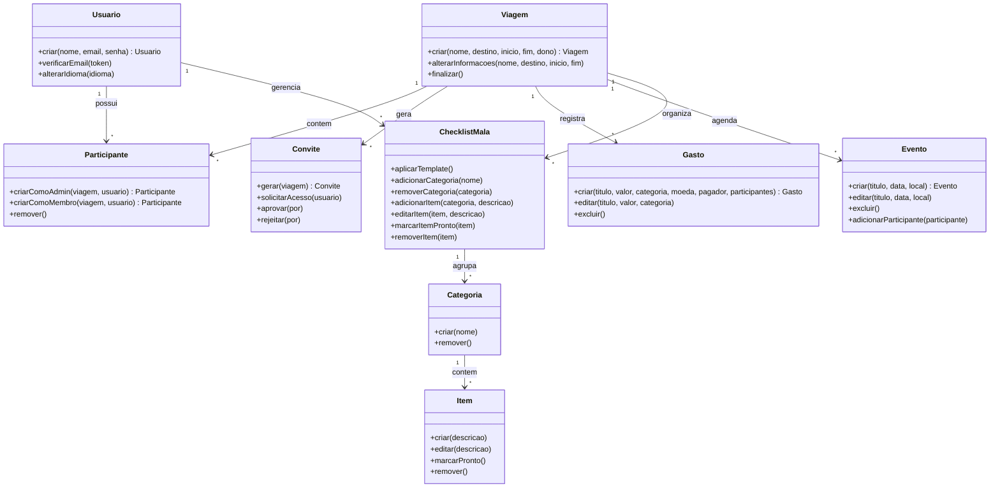

# Diagrama de Classes — EzTrip (Dominio)

```mermaid
classDiagram
    class Usuario {
        +criar(nome, email, senha) Usuario
        +verificarEmail(token)
        +alterarIdioma(idioma)
    }

    class Viagem {
        +criar(nome, destino, inicio, fim, dono) Viagem
        +alterarInformacoes(nome, destino, inicio, fim)
        +finalizar()
    }

    class Participante {
        +criarComoAdmin(viagem, usuario) Participante
        +criarComoMembro(viagem, usuario) Participante
        +remover()
    }

    class Convite {
        +gerar(viagem) Convite
        +solicitarAcesso(usuario)
        +aprovar(por)
        +rejeitar(por)
    }

    class Gasto {
        +criar(titulo, valor, categoria, moeda, pagador, participantes) Gasto
        +editar(titulo, valor, categoria)
        +excluir()
    }

    class Evento {
        +criar(titulo, data, local) Evento
        +editar(titulo, data, local)
        +excluir()
        +adicionarParticipante(participante)
    }

    class ChecklistMala {
        +aplicarTemplate()
        +adicionarCategoria(nome)
        +removerCategoria(categoria)
        +adicionarItem(categoria, descricao)
        +editarItem(item, descricao)
        +marcarItemPronto(item)
        +removerItem(item)
    }

    Usuario "1" --> "*" Participante : possui
    Viagem "1" --> "*" Participante : contem
    Viagem "1" --> "*" Convite : gera
    Viagem "1" --> "*" Gasto : registra
    Viagem "1" --> "*" Evento : agenda
    Viagem "1" --> "*" ChecklistMala : organiza
    Usuario "1" --> "*" ChecklistMala : gerencia
    ChecklistMala "1" --> "*" Categoria : agrupa
    Categoria "1" --> "*" Item : contem

    class Categoria {
        +criar(nome)
        +remover()
    }

    class Item {
        +criar(descricao)
        +editar(descricao)
        +marcarPronto()
        +remover()
    }
```
