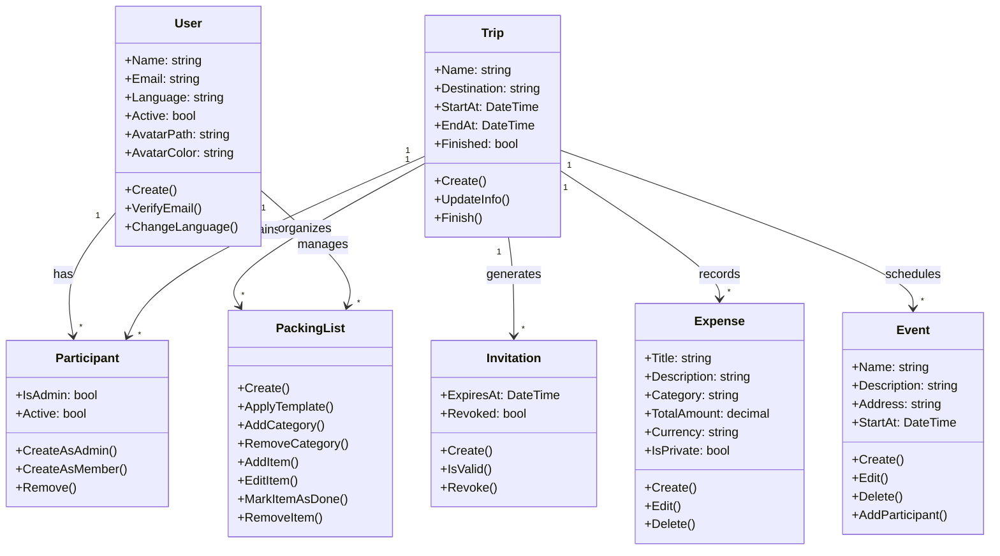

# Class Diagram — EzTrip (Domain)

```mermaid
classDiagram
    class User {
        +Name: string
        +Email: string
        +Language: string
        +Active: bool
        +AvatarPath: string
        +AvatarColor: string
        +Create()
        +VerifyEmail()
        +ChangeLanguage()
    }

    class Trip {
        +Name: string
        +Destination: string
        +StartAt: DateTime
        +EndAt: DateTime
        +Finished: bool
        +Create()
        +UpdateInfo()
        +Finish()
    }

    class Participant {
        +IsAdmin: bool
        +Active: bool
        +CreateAsAdmin()
        +CreateAsMember()
        +Remove()
    }

    class Invitation {
        +ExpiresAt: DateTime
        +Revoked: bool
        +Create()
        +IsValid()
        +Revoke()
    }

    class Expense {
        +Title: string
        +Description: string
        +Category: string
        +TotalAmount: decimal
        +Currency: string
        +IsPrivate: bool
        +Create()
        +Edit()
        +Delete()
    }

    class Event {
        +Name: string
        +Description: string
        +Address: string
        +StartAt: DateTime
        +Create()
        +Edit()
        +Delete()
        +AddParticipant()
    }

    class PackingList {
        +Create()
        +ApplyTemplate()
        +AddCategory()
        +RemoveCategory()
        +AddItem()
        +EditItem()
        +MarkItemAsDone()
        +RemoveItem()
    }

    User "1" --> "*" Participant : has
    Trip "1" --> "*" Participant : contains
    Trip "1" --> "*" Invitation : generates
    Trip "1" --> "*" Expense : records
    Trip "1" --> "*" Event : schedules
    Trip "1" --> "*" PackingList : organizes
    User "1" --> "*" PackingList : manages
```
