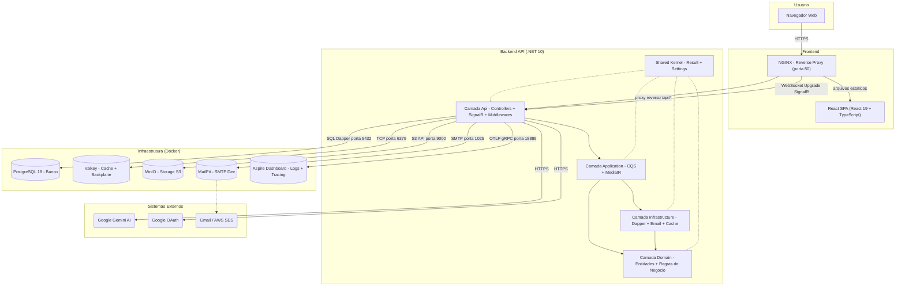
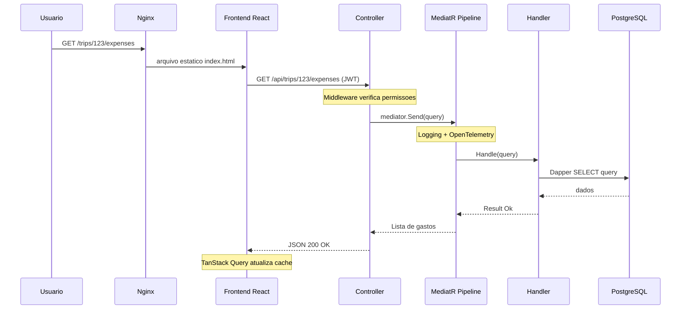
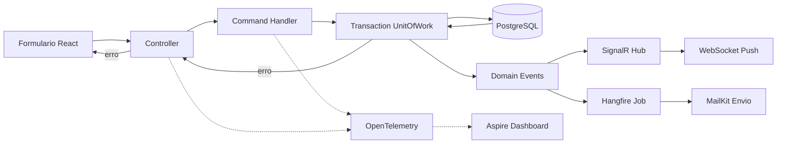
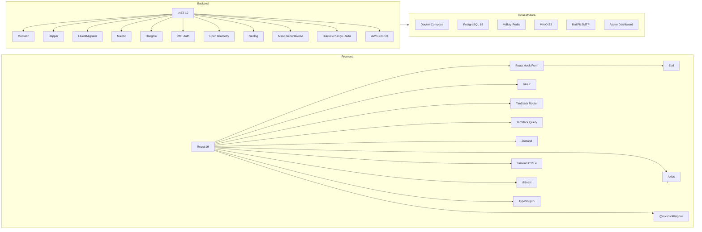

# Diagramas de Arquitetura — EzTrip

## 1. Visão Macro (System Design)

## 2. Fluxo de Requisicao (Pipeline)

## 3. Fluxo de Escrita com Transacao

## 4. Stack Tecnologica

---

> **Nota:** Diagramas baseados no codigo-fonte do EzTrip.
