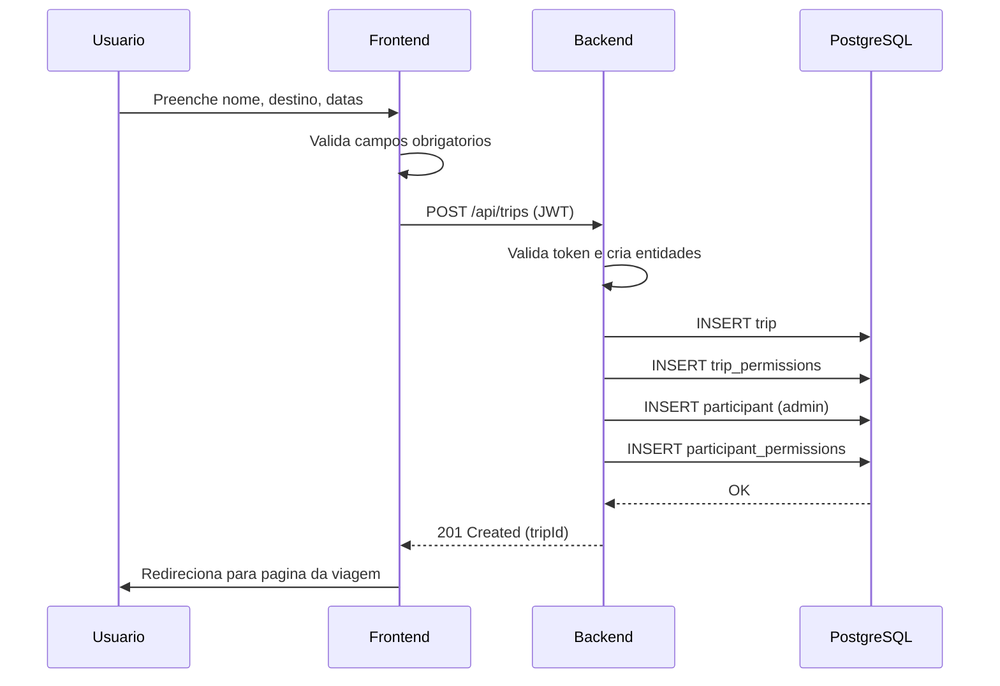
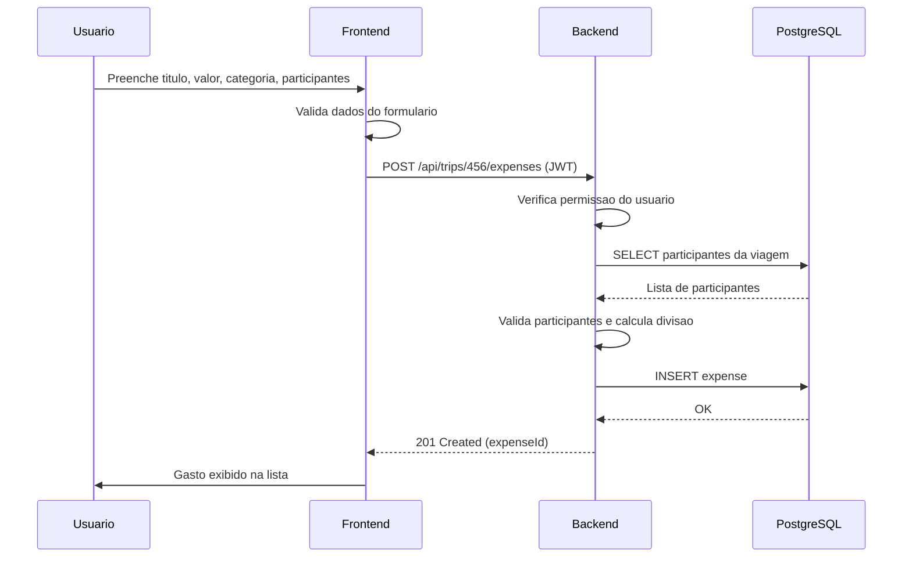

# Diagramas de Sequencia — EzTrip

## UC01 — Criar Viagem

```mermaid
sequenceDiagram
    participant User as Usuario
    participant Front as Frontend
    participant Back as Backend
    participant DB as PostgreSQL

    User->>Front: Preenche nome, destino, datas
    Front->>Front: Valida campos obrigatorios
    Front->>Back: POST /api/trips (JWT)
    Back->>Back: Valida token e cria entidades
    Back->>DB: INSERT trip
    Back->>DB: INSERT trip_permissions
    Back->>DB: INSERT participant (admin)
    Back->>DB: INSERT participant_permissions
    DB-->>Back: OK
    Back-->>Front: 201 Created (tripId)
    Front->>User: Redireciona para pagina da viagem
```

## UC02 — Adicionar Gasto

```mermaid
sequenceDiagram
    participant User as Usuario
    participant Front as Frontend
    participant Back as Backend
    participant DB as PostgreSQL

    User->>Front: Preenche titulo, valor, categoria, participantes
    Front->>Front: Valida dados do formulario
    Front->>Back: POST /api/trips/456/expenses (JWT)
    Back->>Back: Verifica permissao do usuario
    Back->>DB: SELECT participantes da viagem
    DB-->>Back: Lista de participantes
    Back->>Back: Valida participantes e calcula divisao
    Back->>DB: INSERT expense
    DB-->>Back: OK
    Back-->>Front: 201 Created (expenseId)
    Front->>User: Gasto exibido na lista
```
