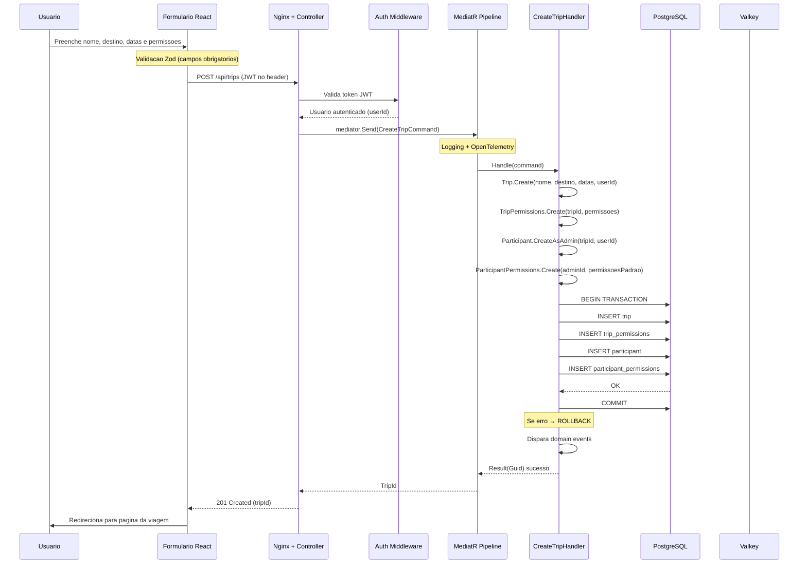
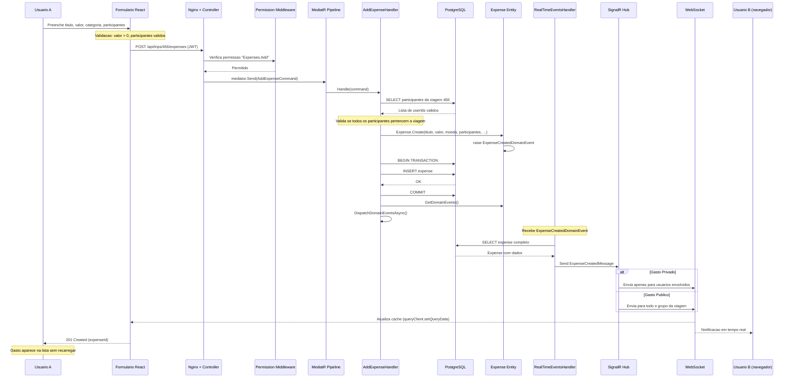

# Diagramas de Sequencia — EzTrip

## UC01 — Criar Viagem

## UC02 — Registrar Gasto com Notificacao em Tempo Real

---

> **Legenda:** As setas representam chamadas sincronas (->>) e assincronas (-->>). As notas (Note over) indicam validacoes e processamentos internos importantes.
